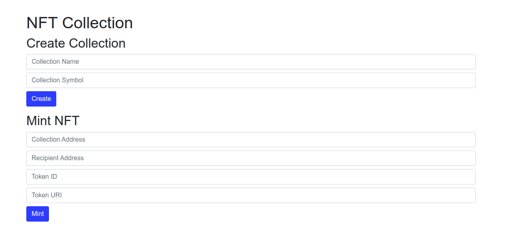

# NFT Collection Project

This project demonstrates how to create and manage NFT collections on the Ethereum blockchain. It includes:

1. **nft-contracts**: Solidity contracts for creating and managing NFT collections.
2. **nft-backend**: An Express server to handle events emitted by the smart contracts.
3. **nft-frontend**: A web application to interact with the smart contracts.


## Deployment
### nft-contracts
1. Navigate to <b>nft-contracts</b> directory:
```shell
cd nft-contracts
```
2. Install dependencies:
```shell
yarn
```
3. Create .env file and populate env variables (refer to .env.example):
```shell
RPC_URL=
PRIVATE_KEY=
```
4. Run tests
```shell
yarn test
```
5. Deploy contract either locally
```shell
yarn deploy-local
```
or on Sepolia testnet
```shell
yarn deploy
```

### nft-backend
1. Navigate to <b>nft-backend</b> directory:
```shell
cd nft-backend
```
2. Install dependencies:
```shell
yarn
```
3. Create .env file and populate env variables (refer to .env.example):
```shell
RPC_URL=
FACTORY_CONTRACT_ADDRESS=
```
4. Start the backend server:
```shell
yarn start
```

### nft-frontend
1. Navigate to <b>nft-frontend</b> directory:
```shell
cd nft-frontend
```
2. Install dependencies:
```shell
yarn
```
3. Create .env file and populate env variables (refer to .env.example):
```shell
RPC_URL=
FACTORY_CONTRACT_ADDRESS=
```
4. Start the frontend server:
```shell
yarn start
```
This will open the application in your default web browser. If not go to
```
http://localhost:9000/
```

## Usage

1. <b>Create a new NFT Collection:</b> Enter a name and symbol for the collection and click <b>"Create"</b>.
2. <b>Mint a new NFT:</b> Enter the collection address, recipient address, token ID, and token URI, then click <b>"Mint"</b>.

The backend server will listen to events emitted by the smart contracts and store them in memory, serving them via HTTP endpoints at <b>/collections</b> and <b>/tokens</b>.
